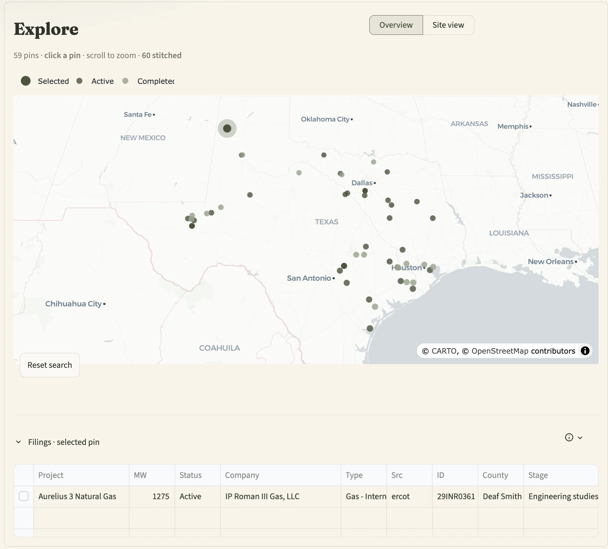
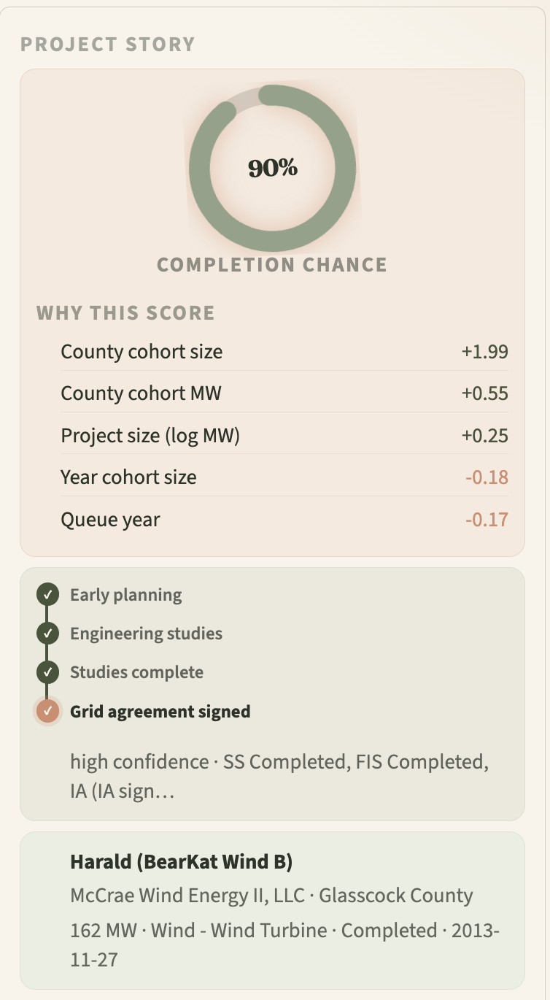
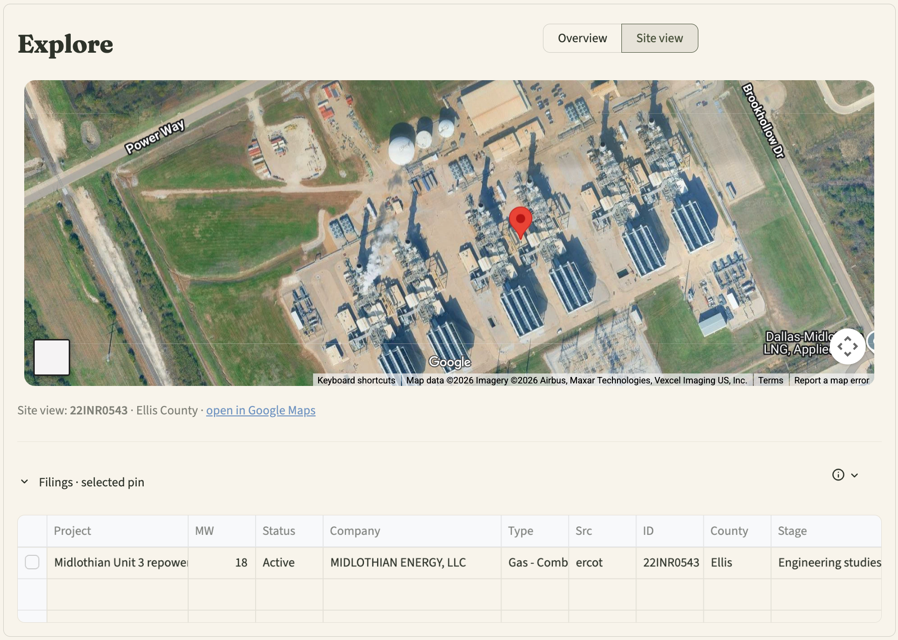
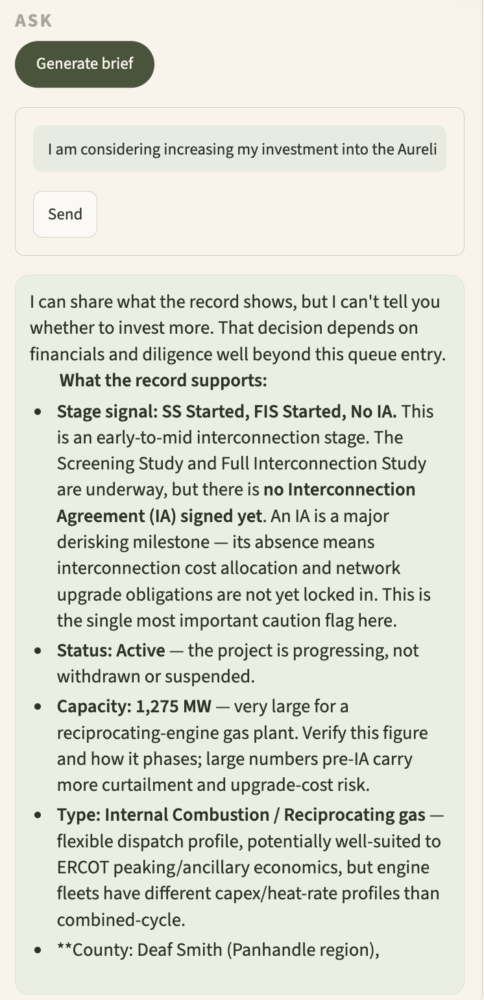

# QueueScore

**Which power projects will actually get built, and why.**

> **▶ Try it now — no setup needed: [https://queuescore.tech/](https://queuescore.tech/)**

Winner, Candid Intelligence Hackathon (Track 1, "Project Radar") · Aug 2026

Most projects that enter the interconnection queue never get built, and the
same real-world project hides under different LLC names in different agency
systems. QueueScore stitches Texas's two live public paper trails — the
**ERCOT interconnection queue** and **TCEQ air permits** — into one map,
scores every project's completion probability, and drafts the brief for the
call you should make about it.

## Features

### Explore the live queue

3,700+ live filings on one map, colored by status — with the **stitched**
lens showing projects confirmed across both sources. Click a pin and every
panel follows.



### A score you can argue with

Every ERCOT project gets a completion probability — an XGBoost model trained
on ~15 years of national queue outcomes (LBNL "Queued Up") — with a SHAP
breakdown of what drove it, and a deterministic stage ladder with the evidence
for each call. Nothing is a black box.



### From filing to fence line

ERCOT filings carry no coordinates — TCEQ permits do. When a project is
stitched, it inherits its permit's exact location: flip to Site view and
inspect the actual site from orbit.



### Ask about any project

One click drafts a seven-part origination brief (verdict, why now, snapshot,
who, angle, evidence, gaps). Free-form questions get answers grounded in the
record's actual fields — including what the filing *doesn't* show.



## Under the hood

- **Cross-source stitching, precision-first.** County gate → name similarity →
  Claude adjudication of ambiguous pairs → an Opus second-opinion pass that
  vetoes weak matches. Every link carries a written reason; ambiguous pairs
  stay unlinked.
- **Rules where rules win, models where they don't.** Deterministic gates and
  stage ladders do the auditable work; the LLM only gets genuine judgment
  calls. The model never sees outcome-encoding columns — leakage is banned in
  `features.py` and enforced by tests.
- **Graceful degradation.** Snapshot cache when offline, full map/scores/links
  with no API key. The demo can't be killed by wifi.

Stack: Python · XGBoost · SHAP · Streamlit · Plotly · gridstatus ·
Anthropic API.

## Run it

```bash
python -m venv .venv && source .venv/bin/activate
pip install -r requirements.txt
streamlit run src/app.py
```

The first run pulls both sources live and caches snapshots; afterwards it
works fully offline. The trained model and match table are committed, so
scores and stitched links need no API key — add `ANTHROPIC_API_KEY` to `.env`
for briefs, Q&A, and match adjudication. Rebuild the match table with
`python -m src.resolve` (add `--second-opinion` for the Opus audit pass).
Tests: `pytest` (29, all offline).

More docs: [SETUP.md](SETUP.md) · [DATA.md](DATA.md) ·
[SOURCES.md](SOURCES.md) (incl. the reverse-engineered TCEQ endpoint) ·
[DEPLOY.md](DEPLOY.md) · [CHARTER.md](CHARTER.md)

## Team

Built in a day by three people:

- **Isaiah McNealy** — [LinkedIn](https://www.linkedin.com/in/isaiahmcnealy/)
- **Tyler Wooten** — [LinkedIn](https://www.linkedin.com/in/tylerwooten/)
- **Camille Little** — [LinkedIn](https://www.linkedin.com/in/camille-little-phd-bb5a95169/)

Or find us via the **Get in touch** button in the app itself.

---

Training data: **LBNL Queued Up (CC BY 4.0)**. Sources: ERCOT interconnection
queue (via gridstatus) · TCEQ Permit Search.
